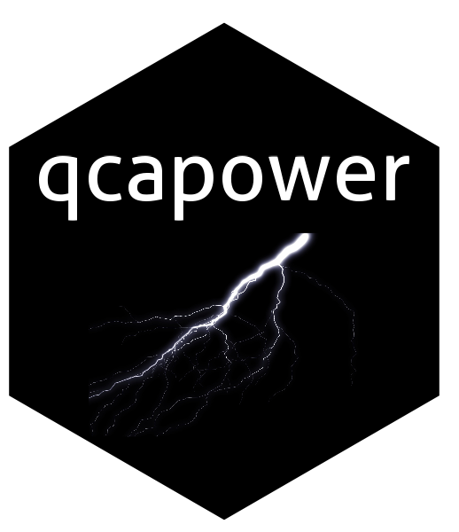

[](https://cran.r-project.org/package=qcapower)
[](https://CRAN.R-project.org/package=qcapower)
[](https://www.repostatus.org/#active)

## Estimating power and required sample size in QCA 
The `qcapower` package for R allows researchers working with Qualitative Comparative Analysis (QCA) to 

* estimate power using permutation tests and create diagnostic plots;
* estimate the required sample size for a target power level.

Version 0.2.0 of the package is available on [CRAN](https://cran.r-project.org/package=qcapower)
and on [Github](https://github.com/ingorohlfing/qcapower). 
Please read the vignette on CRAN or the article here for information about
what you can do with the package.

```r
install.packages("qcapower")
library(qcapower)
```

The current version can be installed from Github. 

```r
pak::pak("ingorohlfing/qcapower")
library(qcapower)
```
***

We received funding from the European Research Council (ERC) under the European 
Union’s Horizon 2020 research and innovation program (grant agreement nr. 638425,
*Enhanced Qualitative and Multimethod Research*).
